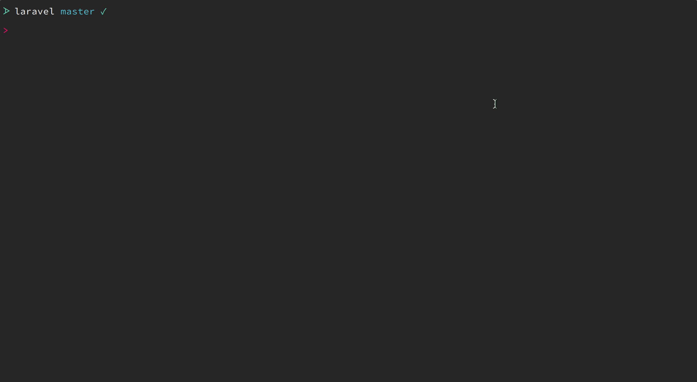

# Laravel Preset

I figured rather than having a base repository with Laravel already installed it might be neat to try using a preset to configure a fresh installation. 🤷‍♂️



## Overview
### Composer Packages
- [bensampo/laravel-enum](https://github.com/BenSampo/laravel-enum) - optional
- [silber/bouncer:v1.0.0-rc.4](https://github.com/JosephSilber/bouncer) - optional
- [sentry/sentry-laravel](https://github.com/getsentry/sentry-laravel) - optional
- [dyrynda/laravel-model-uuid](https://github.com/michaeldyrynda/laravel-model-uuid) - optional
- [sempro/phpunit-pretty-print](https://github.com/sempro/phpunit-pretty-print) (dev)
- [sensiolabs/security-checker](https://github.com/sensiolabs/security-checker) (dev)

### Stubs
- `phpunit.xml`
    - Adds `APP_KEY`
    - Configures sqlite in-memory database
- `app/Model.php` - A base model setup to bypass mass assignment
- `.docker/` and `docker-compose.yml`
    - A simple docker development configuration
- `database/seeds/BouncerSeeder.php` - Bouncer permissions seeder (only if you included the package)
- `.php_cs`
- `.editorconfig`

### ENV Changes
- Changes `DB_PORT` to match the docker configuration for `.env` and `.env.example`
- Adds docker configuration to `.env` and `.env.example`
- Adds `SENTRY_DSN` to `.env` and `.env.example` (only if you included the package)

### Tailwindcss
- Adds these node packages:
    - laravel-mix-purgecss:^2.2.0
    - postcss-nesting:^5.0.0
    - postcss-import:^11.1.0
    - tailwindcss:>=0.6.1
- Removes the `sass` directory
- Removes `app.css`
- Publishes
    - Tailwind `app.css` template
    - An updated welcome blade template
    - An updated `webpack.mix.js`

## Installation
**Note:** It is assumed that this is being ran on a fresh installation of Laravel.

You can install the package via composer:

```bash
> composer require --dev sixlive/laravel-preset
```

## Usage

```bash
> php artisan preset sixlive
```

### Changelog

Please see [CHANGELOG](CHANGELOG.md) for more information on what has changed recently.

## Contributing

Please see [CONTRIBUTING](CONTRIBUTING.md) for details.

### Security

If you discover any security related issues, please email oss@tjmiller.co instead of using the issue tracker.

## Credits

- [TJ Miller](https://github.com/sixlive)
- [All Contributors](../../contributors)

## License

The MIT License (MIT). Please see [License File](LICENSE.md) for more information.
