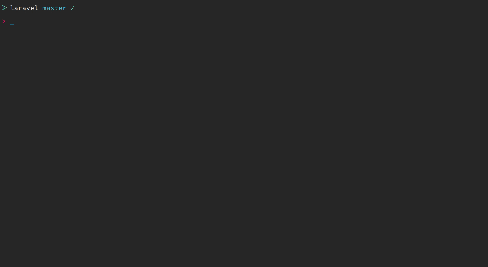

# Laravel Preset

I figured rather than having a base repository with Laravel already installed it might be neat to try using a preset to configure a fresh installation. 🤷‍♂️



**Requires the following composer packages:**
- `bensampo/laravel-enum`
- `silber/bouncer:v1.0.0-rc.4`
- `sentry/sentry-laravel`
- `dyrynda/laravel-model-uuid`
- `sempro/phpunit-pretty-print` (dev)
- `sensiolabs/security-checker` (dev)

**Publishes stubs:**
- `phpunit.xml`
    - Adds `APP_KEY`
    - Configures sqlite in-memory database
- `app/Model.php` - A base model setup to bypass mass assignment
- `.docker/` and `docker-compose.yml`
    - A simple docker development configuration
- `database/seeds/BouncerSeeder.php` - Bouncer permissions seeder

**Updates the ENV files:**
- Changes `DB_PORT` to match the docker configuration for `.env` and `.env.example`
- Adds docker configuration to `.env` and `.env.example`
- Adds `SENTRY_DSN` to `.env.example

**To Do:**
- [ ] Implement front end config from [adamwathan/laravel-preset](https://github.com/adamwathan/laravel-preset)

## Installation
This package isn't on Packagist, so to get started, add it as a repository to your `composer.json` file:

```json
"repositories": [
    {
        "type": "vcs",
        "url": "https://github.com/sixlive/laravel-preset"
    }
]
```


You can install the package via composer:

```bash
> composer require --dev sixlive/laravel-preset
```

## Usage

```bash
> php artisan preset sixlive
```

### Changelog

Please see [CHANGELOG](CHANGELOG.md) for more information on what has changed recently.

## Contributing

Please see [CONTRIBUTING](CONTRIBUTING.md) for details.

### Security

If you discover any security related issues, please email oss@tjmiller.co instead of using the issue tracker.

## Credits

- [TJ Miller](https://github.com/sixlive)
- [All Contributors](../../contributors)

## License

The MIT License (MIT). Please see [License File](LICENSE.md) for more information.
